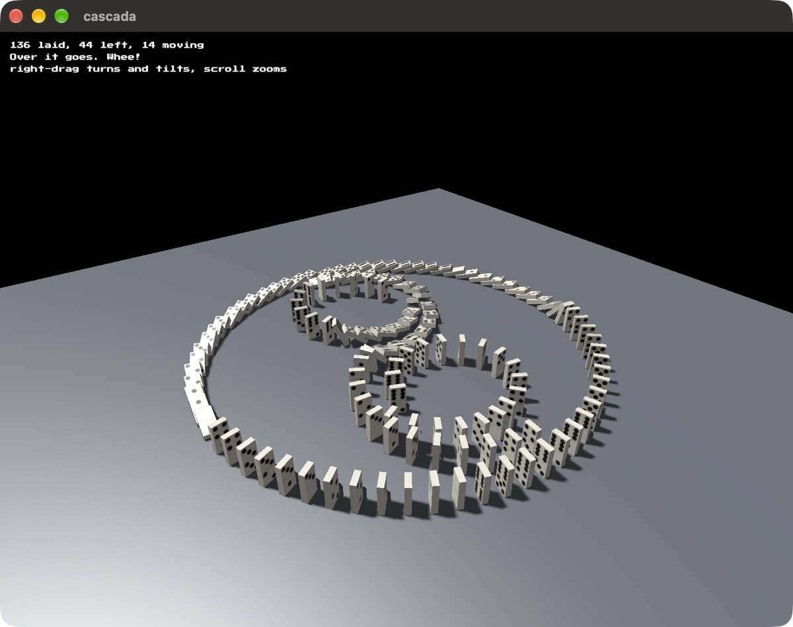

# cascada

Stand dominoes up on a floor, one at a time, wherever you like. Then push the
first one. The number at the end is how many fell.



```
cargo run --release
```

Spacing is yours and nothing enforces it. Too close and a falling domino has
nowhere to swing before it meets the next. Too far and it falls short.

Built on [blitzkit](https://github.com/jvalol/blitzkit), and it exists for one
part of the engine in particular: a body touching one that has woken wakes too,
outwards through the contacts. A line of dominoes is that rule and almost
nothing else, and the number of them awake is on screen so you can watch the
wave run ahead of the fall.

Specs are in [`specs/`](specs/), written before the code.

## Licence

MIT or Apache-2.0, at your option.

---

I asked AI to draft this for me. I've edited it. Any surviving AI smells are my oversight.
